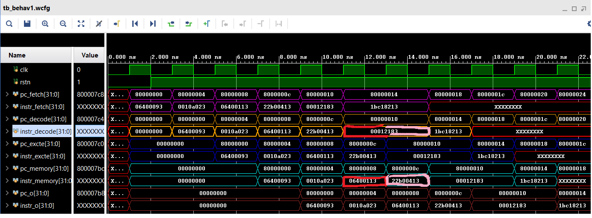

    Normalde stall olunca decode ve diğer aşamalrdaki çıkışlar tekrar girişe veriliyordu. Ancak aşağadaki ekstrem durumu yani farkettim dual issue yaparken.

06400093
0010a023
06400113
22b00413
00012183
1bc18213

		addi x1,x0,100
        sw x1,0(x1)
    	addi x2,x0,100
        addi x8,x0,555
        lw x3,0(x2)
        add x4,x3,444

        bu kodda şöyle bir sıkıntı var :

            lw x3 olup altta rs1 de x3 olunca stall oluyor lw x3 2 defa çıkışa veriliyor totalde. ilk defa pipelined dan çıkışa verildiğinde addi x2'nin 2 altında olduğu için write backden execute forwarding oluyor. Stall yüzünden bir defa da çıkışa lw x3 komutu gittğinde sıkıntı oluyor. Niye oluyor?

                	addi x2,x0,100
                    addi x6,x2,555
                    add x4,x0,x2
                    sub x5,x2,x7
            Mesela kod böyle olunca addi x6 için memoryden execute da forwarding, add x4 için write backden forwarding, sub x5 de register file a negedge de yazıldığı için decoda sorunsuz okuma yapılıyor.

            Ancak bizim en yukarıda kodda. stall yüzünden decode lw x3'ü çıkışa tekrar verdiginde x2 registera yazılmış olacak ama sen eski rs1 rs2 yi tekrar çıkışa verdigin için x2'nin eski halini alıyorsun çünkü wb de x2 registera lw3 tekrar çıkışa geldiğinde aynı anda yazaılıyor dolayısıyla lw x3 tekrar gelince eski x2 değeri kalıyor registerda wb stage de. bunu lw x3 stall olunca giriş instr vererek yapabilirsin ama bu seferde başka sıkıntılar oluyor. lw x3 stall olmadan önce ilk kez çıkışa gittiğinde forward oluyor addi x2 'den ama tekrar aynı instr gittiğinde forward olmuyor registera yazılıyor ancak sen eski rs1 rs2 aldığın için yanlış oluyor.
            O yüzden nop göndermek gerekiyor stall olunca

